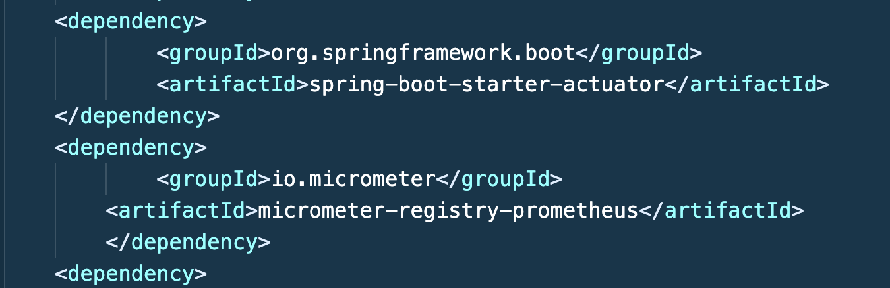
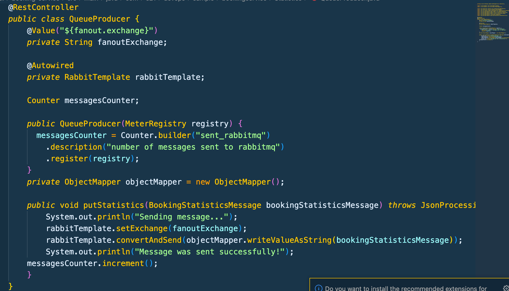
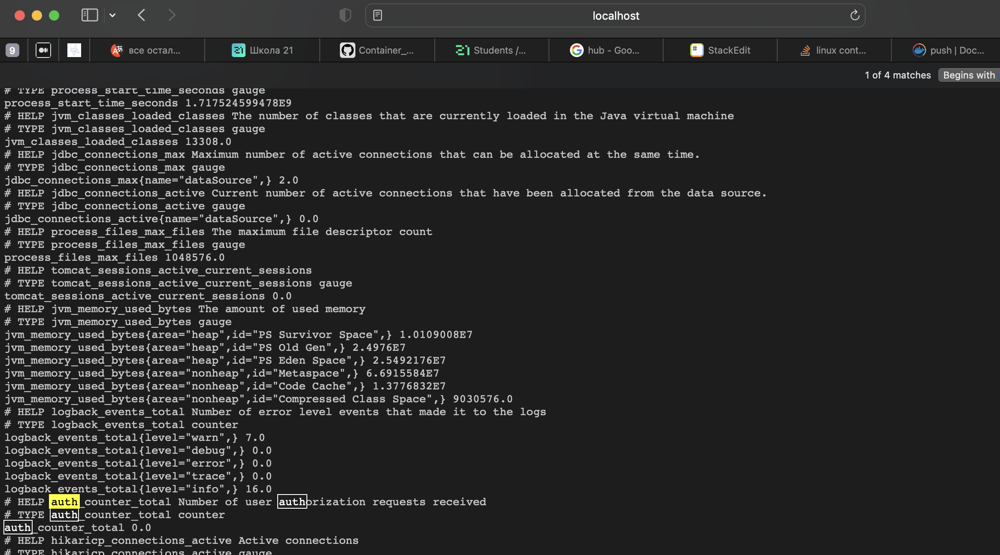
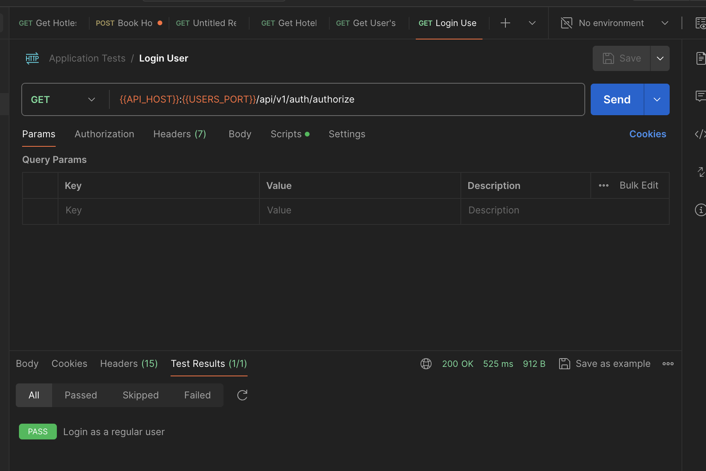
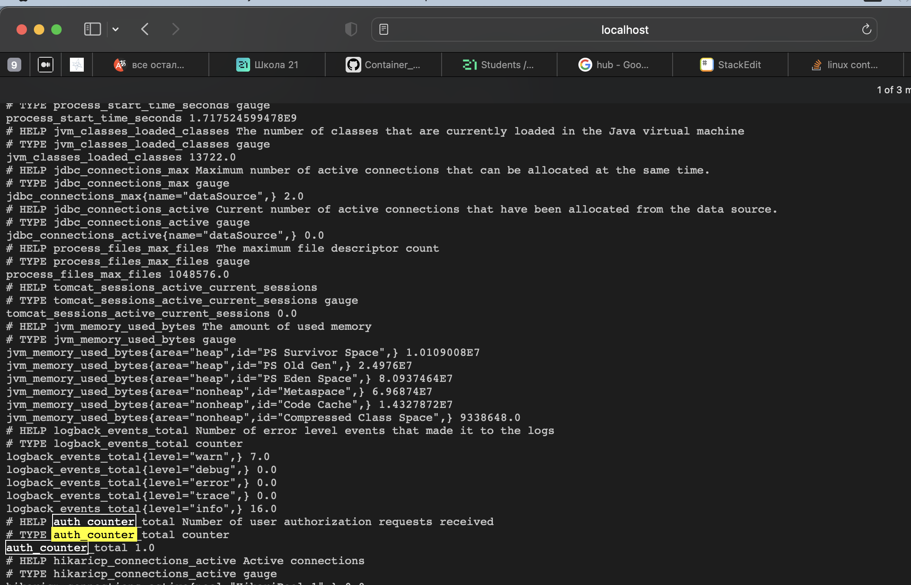
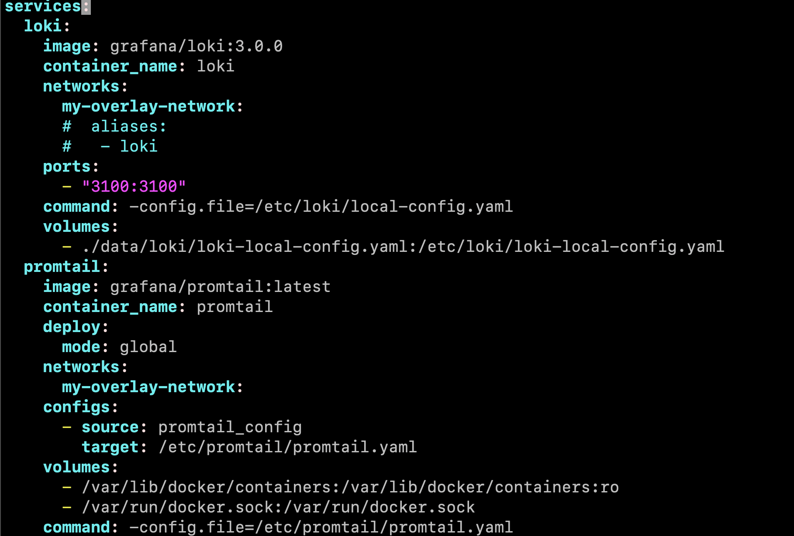
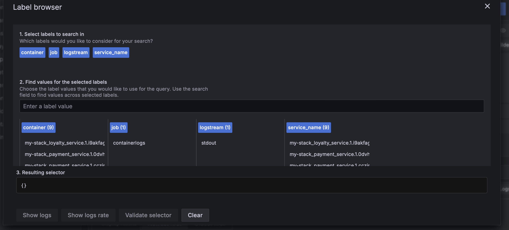

## Part 1. Getting metrics and logs

### Use the Micrometer library to write the following application metrics collectors:
 - number of messages sent to rabbitmq; 
 - number of messages processed in rabbitmq; 
 - number of bookings; 
 - number of requests received at the gateway; 
 - number of user authorization requests received.

##### Added all dependencies for creating and getting custom metrics

##### An example of how I created custom metrics using the micrometer library

> all other custom metrics can be found in the service directories/src
##### Custom metric before - get request 

##### Custom metric after - get request 

> etc... 

### Add application logs using Loki.

