## Part 1. Getting metrics and logs

### Use the Micrometer library to write the following application metrics collectors:
 - number of messages sent to rabbitmq; 
 - number of messages processed in rabbitmq; 
 - number of bookings; 
 - number of requests received at the gateway; 
 - number of user authorization requests received.

#### Added all dependencies for creating and getting custom metrics

#### An example of how I created custom metrics using the micrometer library

> all other custom metrics can be found in the service directories/src
#### Custom metric before - get request 

#### Custom metric after - get request 

> etc... 

### Add application logs using Loki.

### Create a new stack for the docker swarm of services with Prometheus Server, Loki, node_exporter, blackbox_exporter, cAdvisor.
> You can find the docker compose file for this stack in the ./docker-stacks/ directory 

#### Two stacks have been created 
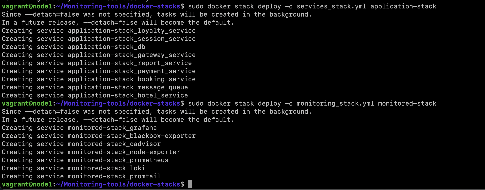
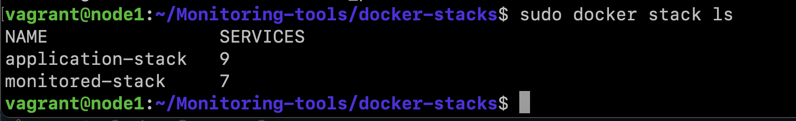

### Check receiving metrics on port 9090 via a browser.
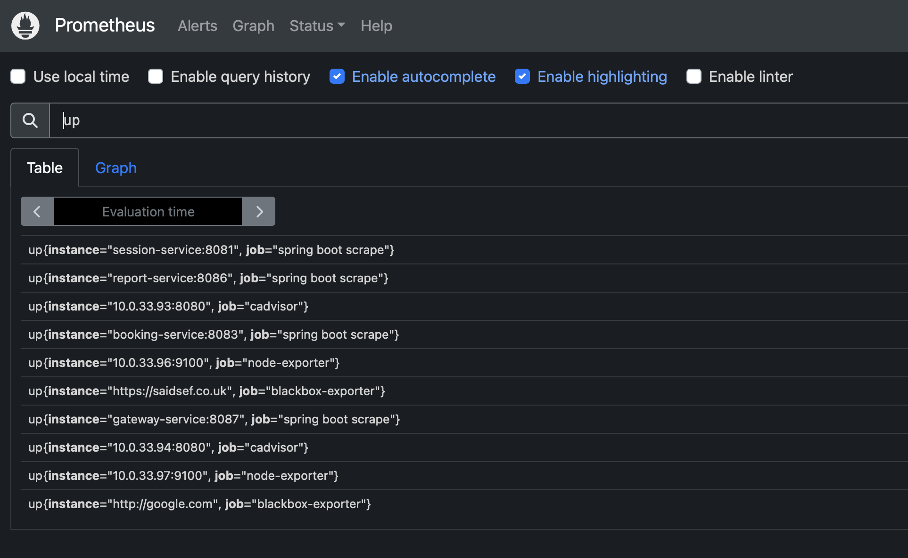

## Part 2. Visualization
### 1.Add a dashboard with the following metrics to grafana:
-   number of nodes;
-   number of containers;
-   number of stacks;
-   CPU usage for services;
-   CPU usage for cores and nodes;
-   spent RAM;
-   available and used memory;
-   number of CPUs;
-   google.com availability;
-   number of messages sent to rabbitmq;
-   number of messages processed in rabbitmq;
-   number of bookings;
-   number of requests received at the gateway;
-   number of user authorization requests received;
-   application logs.

#### 2. Custom metrics from spring boot services
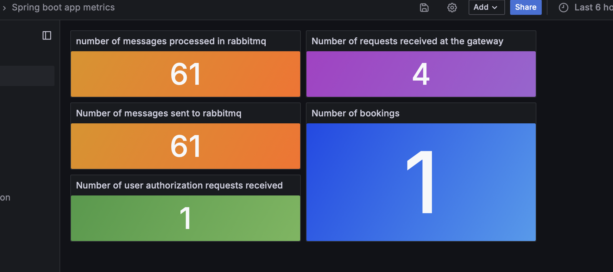
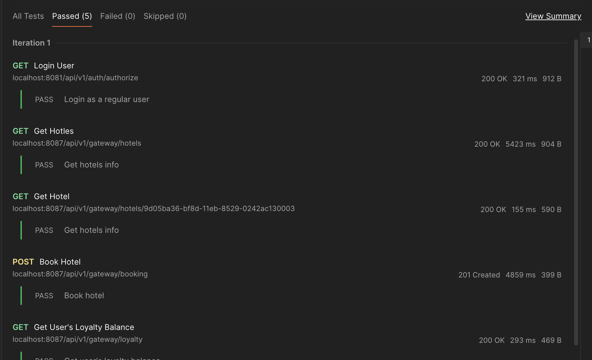
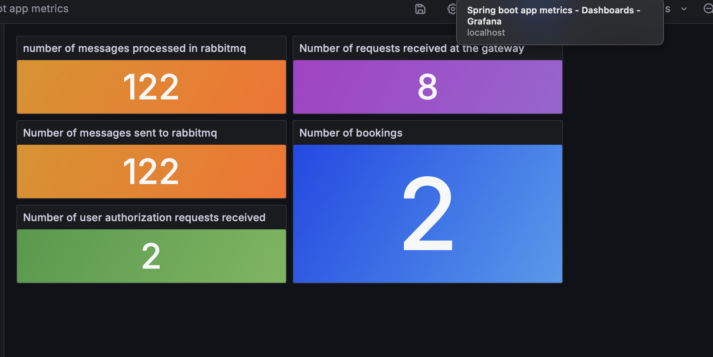

#### 3. Cadvisor's metrics
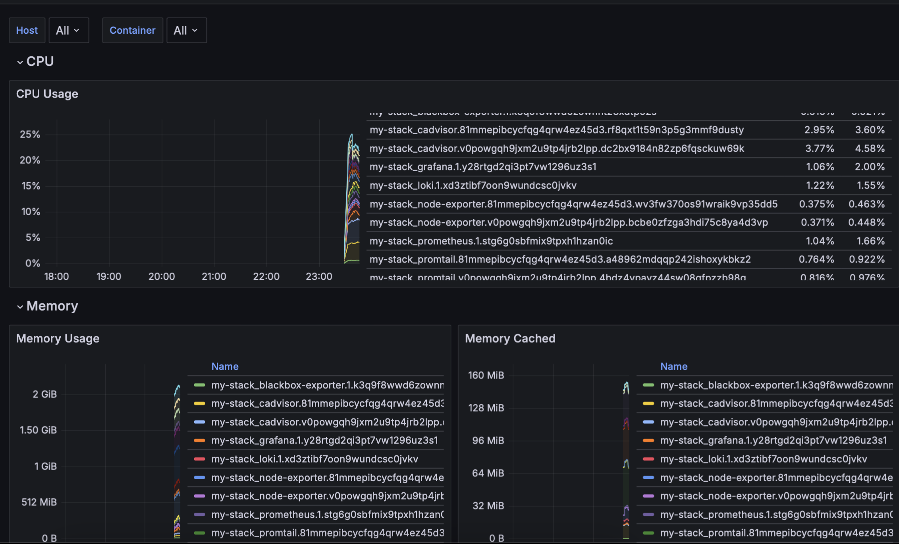

#### 4. Node exporter's metrics
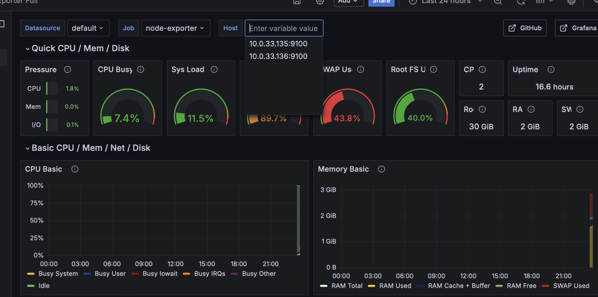

#### 5. Blackbox exporter's metrics
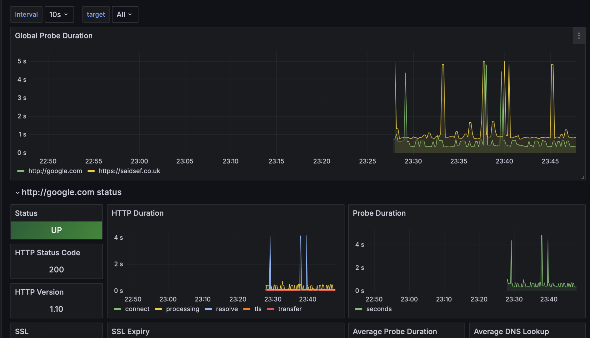

#### 6. Application logs - Loki
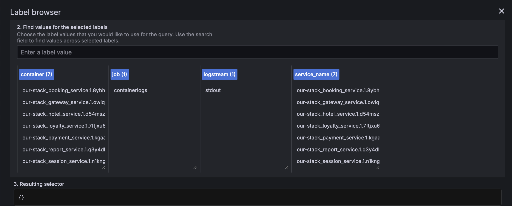

## Part 3. Critical event monitoring

#### 1. Deploy alert manager as a new service in the monitored stack
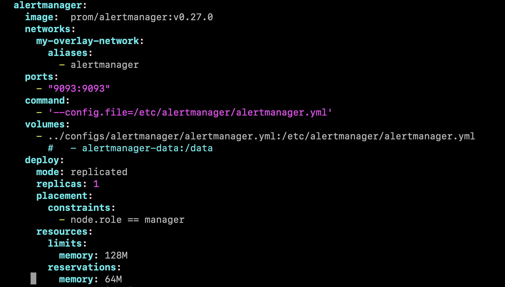

#### 2. Add the following critical events:
- available memory is less than 100 mb;
- spent RAM is more than 1gb;
- CPU usage for the service exceeds 10%.
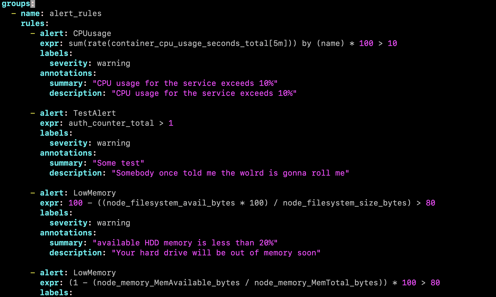

#### 3. Configure notifications via personal email or Telegram.
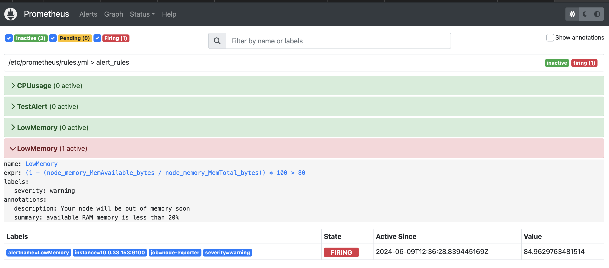
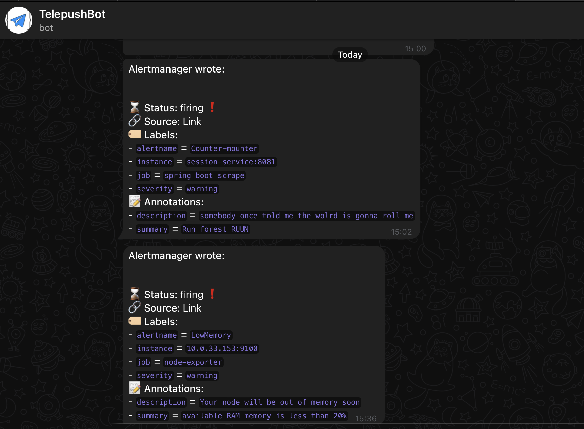

